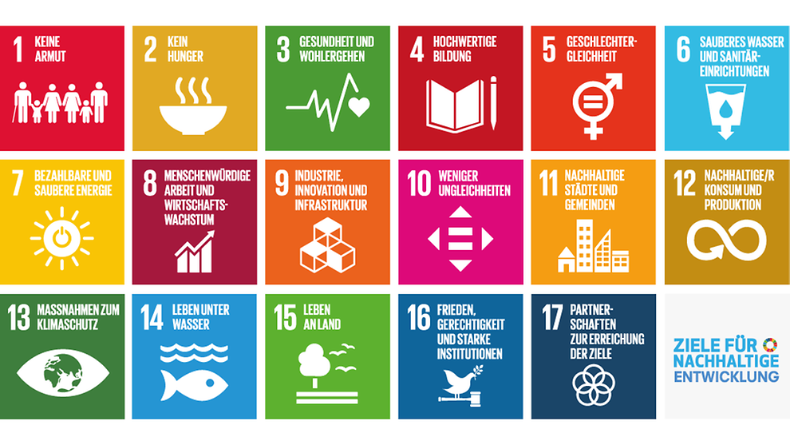

# Planung zu "Projektstart"

[Infos zum Thema: **17ziele.de**](https://17ziele.de/)\*\*\*\*

## Festlegung des Themenbereichs

Wir müssten entscheiden, wie wir im Projektstart vorgehen wollen:

1. Alle Nachhaltigkeitsthemen vorstellen und die Kinder wählen lassen?
2. Einige Nachhaltigkeitsthemen vorauswählen und die Kinder das Thema wählen lassen?
3. Ein Nachhaltigkeitsthema festlegen.
4. Losen
5. Über ein Spiel ermitteln.

## Erklärkonzepte für die 17 Ziele entwickeln

Wir müssen sicherstellen, dass die Nachhaltigkeitsthemen nicht als Bedrohung wahrgenommen werden. Dazu sollten wir ein Konzept entwickeln.

z.B. "Mittelalter hatte seine Probleme, wir haben unsere... AIJ

## Umsetzungsideen für den physischen Raum entwickeln

z.B. die Schablonen in der Schule nutzen. MJA

## Planungsaufgaben zum Ende der Phase

Vorausplanung: Bestimmung des komplexen Gegenstands: ergibt sich aus der Entscheidung oben.

Dauer des Projekts: Das erste Projekt ist auf 3 Wochen festgelegt, die Folgeprojekte sind 6-8 Wochen lang und orientieren sich am Ablauf des Schuljahrs

Kooperationen:

Ressourcen: wenn man bereits ein Thema hat, kann die Auswahl für das [Materialangebot ](../../materialangebot.md)schon beginnen.

Mittel:

## Ergebnis

Ein [Nachhaltigkeitsziel](../../nachhaltigkeitsziel.md) ist für die Schüler\*innen ausgewählt.

