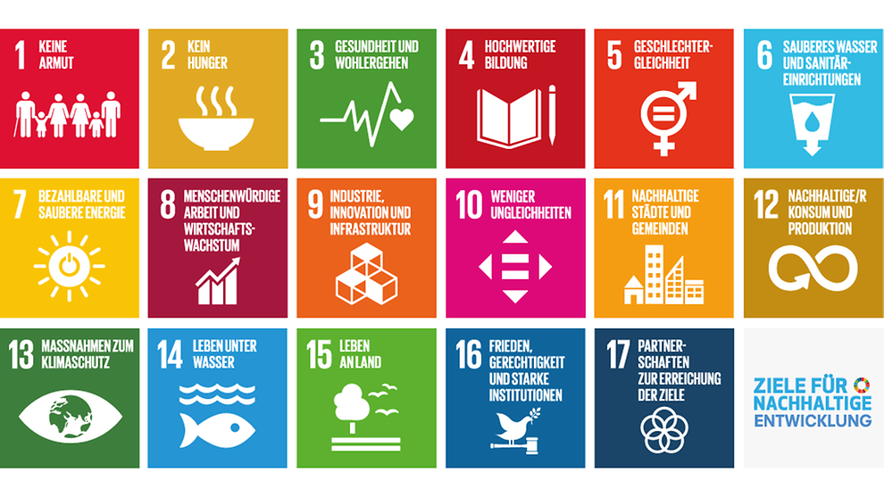

# Zum "Projektstart"

Infos zum Thema: [17ziele.de](https://17ziele.de)

## Festlegung des Themenbereichs

Wir müssten entscheiden, wie wir im Projektstart vorgehen wollen:

1. Alle Nachhaltigkeitsthemen vorstellen und die Kinder wählen lassen?
2. Einige Nachhaltigkeitsthemen vorauswählen und die Kinder das Thema wählen lassen?
3. Ein Nachhaltigkeitsthema festlegen.
4. Losen
5. Über ein Spiel ermitteln.
6. Aus den Nachüberlegungen eines Vorgängerprojekts enstehend

## Erklärkonzepte für die 17 Ziele entwickeln

Wir müssen sicherstellen, dass die Nachhaltigkeitsthemen nicht als Bedrohung wahrgenommen werden. Dazu sollten wir ein Konzept entwickeln.

z.B. "Mittelalter hatte seine Probleme, wir haben unsere... AIJ

## Umsetzungsideen für den physischen Raum entwickeln

Wir wollen nicht nur "Digitalunterricht". Auch wenn das Projektbuch unsere zentrale Prozess- und Ergebnisablage ist, sollen die Schüler\*innen auch in der physischen Welt aktiv werden.

Ideen dazu

* die Schablonen von [17ziele.de](https://17ziele.de) in der Schule nutzen. 
* **Planungsaufgaben zum Ende der Phase**

Vorausplanung: Bestimmung des Nachhaltigkeitsziels: ergibt sich aus der Entscheidung oben.

Dauer des Projekts: Das erste Projekt ist auf 3 Wochen festgelegt, die Folgeprojekte sind 6-8 Wochen lang und orientieren sich am Ablauf des Schuljahrs

Kooperationen: fallweise zu klären. Können wir hier vorausplanen?

Ressourcen: wenn man bereits ein Thema hat, kann die Auswahl für das [Materialangebot ](../../wiki/definitionen/materialangebot.md)schon beginnen. Sonst erst in der [Planungsphase](planung-zu-planung.md).

Mittel: Sollte es ein Projektbudget geben? Welches Material kann als vorhanden vorausgesetzt werden, wie entsteht später \(in der [Planungsphase](planung-zu-planung.md)\) eine "Projektmaterialliste"?

Was ist möglich als Aktion für den Einstieg? Was kann den Schülern dazu angeboten werden? z.B. Film, Ausflug, Experten-Interview... Wo werden diese Ideen gesammelt? Sollten die Schüler dies auch vorschlagen können?

**Noch offen:** Wo und wie planen und dokumentieren Lernbegleiter? Evtl brauchen wir hier noch eine geschützte separate Ablage \(oder hier im Projektbuch?\). Es darf auf jeden Fall keine "Privatablagen" geben. Das Wissen über das Projekt und die Teilnehmer ist auf Schulseite Gemeingut, damit eine gemeinsame Durchführung von Projekten, z.b. im Vertretungsfall möglich ist.

## Ergebnis

Ein [Nachhaltigkeitsziel](../../wiki/definitionen/nachhaltigkeitsziel.md) ist für die Schüler\*innen ausgewählt.

Eine mögliche Startaktion für den Einstieg ist skizziert.

